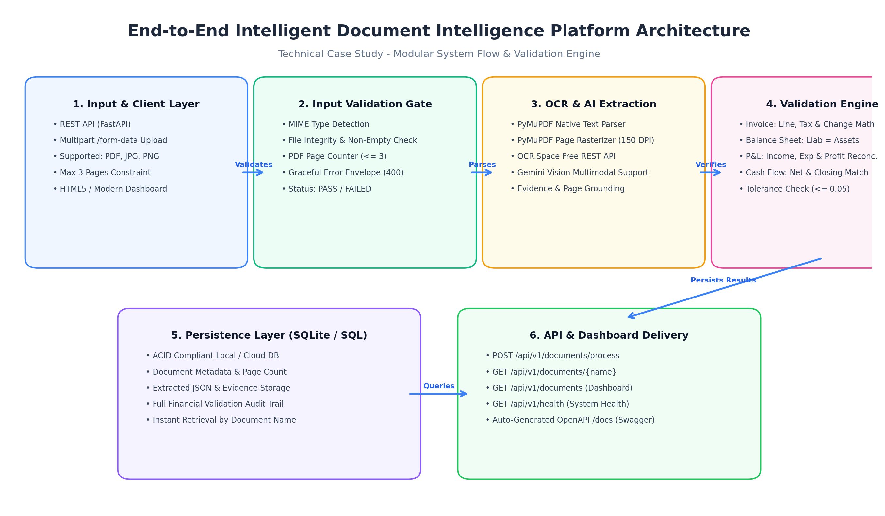

# 🧠 NeuroDoc AI
## Intelligent Document Extraction, Validation & API Platform

[](https://fastapi.tiangolo.com)
[](https://www.python.org/)

An end-to-end, production-ready AI-powered document intelligence platform that ingests native and scanned financial documents (Invoices, Balance Sheets, Profit & Loss Statements, and Cash Flow Statements), validates file constraints, performs OCR and complete structured field/table extraction with evidence grounding, verifies domain-specific financial calculations, persists records in a persistent ACID database, and surfaces results via an interactive dashboard and OpenAPI-compliant REST APIs.

---

## 🏗️ Overview & Architecture

The platform is designed around a decoupled, 6-tier pipeline to guarantee high availability, testability, and strict financial auditability:

📄 Document Upload (PDF / JPG / PNG)
        ↓
🛡️ Document Validation Gate
        ↓
🔍 Text Extraction & OCR
        ↓
🤖 AI-based Field & Table Extraction
        ↓
🎯 Evidence Grounding & Confidence Scoring
        ↓
🧮 Financial Calculation Validation Engine
        ↓
💾 Persistent Storage
        ↓
🌐 Delivery Layer (Dashboard + REST API)
```



### ✨ Architecture Highlights

1. **🛡️ Input Validation Layer**: Guards downstream compute by checking file integrity (`PIL.verify()`, PyMuPDF bounding box read), non-empty payloads, allowed MIME extensions (`.pdf`, `.jpg`, `.jpeg`, `.png`), and page count constraints ($\le 3$ pages).
2. **🔍 Dual-Tier OCR**: Automatically detects native PDF vector text or seamlessly rasterizes scanned pages at 150 DPI for OCR.Space / Gemini Vision processing.
3. **🎯 Evidence Grounding**: Binds every critical financial figure to a concrete `source_text` excerpt and `page_number` for audit verification.
4. **🧮 Financial Validation Engine**: Performs independent mathematical checks for all supported financial document types with configurable numerical tolerance ($\pm 0.05$).

---

## 🛠️ Technology Stack & Rationale

| 🏷️ Component |⚙️ Technology | 💡 Rationale |
| :--- | :--- | :--- |
| **Backend Framework** | **FastAPI** | High-performance asynchronous REST framework with native OpenAPI 3.0 (Swagger UI at `/docs`), Pydantic data validation, and multipart form support. |
| **Document Processing** | **PyMuPDF (fitz)** | High-speed, robust PDF parsing and rasterization without requiring external C/C++ dependencies like Poppler. |
| **OCR Service** | **OCR.Space REST API** | Free-tier cloud OCR engine providing high-precision table extraction without requiring system-level Tesseract installations. |
| **Multimodal Vision** | **Google Gemini 2.5 Flash** | Integrated via `google-genai` for zero-shot structured financial extraction on complex, degraded layouts. |
| **Persistence** | **SQLite 3** | Zero-configuration, ACID-compliant database ideal for containerized deployments and evaluator test runs without external DB provisioning. |
| **Frontend** | **Jinja2 + HTML5 / CSS3 / Vanilla JS** | Lightweight, zero-build-step responsive UI with status badges, formula breakdown cards, and raw JSON copy/export features. |
| **Testing** | **unittest & pytest** | Comprehensive unit and integration test coverage for validation formulas, edge cases, and API routes. |

---

## 🌍 Deployed URLs & Public Repository

| 🔗 Resource | 🌐 URL |
| :--- | :--- |
| **Public GitHub Repository** | [https://github.com/PoojaKumar2004/intelligent-document-platform](https://github.com/PoojaKumar2004/intelligent-document-platform) *(Update with your repo)* |
| **Live Deployed Frontend** | `https://intelligent-document-platform.onrender.com/` *(Render/Railway URL)* |
| **Live Backend API Base** | `https://intelligent-document-platform.onrender.com/api/v1` |
| **Interactive Swagger Docs** | `https://intelligent-document-platform.onrender.com/docs` |
| **System Health Endpoint** | `https://intelligent-document-platform.onrender.com/api/v1/health` |

---

## 🚀 Local Setup & Quickstart

### 📋 Prerequisites
- 🐍 Python 3.10, 3.11, 3.12, 3.13, or 3.14
- 🌿 Git

### ⚡ Installation Steps
```bash
# 1. Clone the repository
git clone https://github.com/PoojaKumar2004/intelligent-document-platform.git
cd intelligent-document-platform

# 2. Create and activate a virtual environment
python -m venv venv
# On Windows:
.\venv\Scripts\activate
# On Linux/macOS:
source venv/bin/activate

# 3. Install dependencies
pip install -r requirements.txt

# 4. Configure environment variables
cp .env.example .env

# 5. Start the platform server
python -m uvicorn backend.app.main:app --host 0.0.0.0 --port 8001 --reload
```

Open your browser at `http://localhost:8001/` to access the Dashboard, or `http://localhost:80001docs` to test via Swagger UI.

---

## 🔑 Environment Variables (`.env.example`)

| 🔑 Variable | 📌 Default | 📝 Description |
| :--- | :--- | :--- |
| `PORT` | `8000` | Port for the web and API server. |
| `DATABASE_PATH` | `documents.db` | Path to persistent SQLite database file. |
| `UPLOAD_DIR` | `uploads` | Directory for staging uploaded documents. |
| `MAX_PAGES` | `3` | Maximum allowed page count per document. |
| `FINANCIAL_TOLERANCE` | `0.05` | Numerical variance threshold for rounding reconciliations. |
| `OCR_SPACE_API_KEY` | `helloworld` | Free OCR.Space API key (obtain free key at ocr.space). |
| `GEMINI_API_KEY` | `""` | Optional Google Gemini API key for multimodal vision extraction. |

---

## 📡 API Reference & Request Examples

### 📤 Process Document (`POST /api/v1/documents/process`)
Accepts multipart form upload with `file` and `document_type` (`invoice`, `balance_sheet`, `profit_and_loss`, `cash_flow_statement`).

**cURL Request:**
```bash
curl -X POST "http://localhost:8000/api/v1/documents/process" \
  -F "file=@sample_invoice.pdf" \
  -F "document_type=invoice"
```

**Response (HTTP 200 OK):**
```json
{
  "document_name": "sample_invoice.pdf",
  "document_type": "invoice",
  "processing_status": "PASS",
  "overall_confidence": 0.96,
  "file_validation": {
    "file_type": "application/pdf",
    "is_supported": true,
    "is_readable": true,
    "page_count": 1,
    "status": "PASS"
  },
  "extracted_data": {
    "invoice_number": { "value": "INV-23891", "confidence": 0.98, "page_number": 1, "evidence": { "source_text": "Invoice no: INV-23891", "page_number": 1 } },
    "subtotal": { "value": 12500.00, "confidence": 0.98, "page_number": 1 },
    "tax_amount": { "value": 625.00, "confidence": 0.97, "page_number": 1 },
    "discount": { "value": 0.00, "confidence": 0.95, "page_number": 1 },
    "total_amount": { "value": 13125.00, "confidence": 0.99, "page_number": 1 },
    "line_items": [
      { "description": "Consulting Service", "quantity": 1, "unit_price": 12500.00, "amount": 12500.00 }
    ]
  },
  "validation": {
    "checks": [
      {
        "name": "invoice_total_check",
        "formula": "subtotal + tax_amount - discount",
        "operands": { "subtotal": 12500.00, "tax_amount": 625.00, "discount": 0.00 },
        "calculated_value": 13125.00,
        "reported_value": 13125.00,
        "variance": 0.00,
        "status": "PASS",
        "message": "Calculation matches reported value."
      }
    ],
    "overall_status": "PASS",
    "issues": []
  },
  "processing_metadata": {
    "ocr_used": true,
    "ocr_engine": "OCR.Space-API",
    "processed_at": "2026-09-10T12:00:00Z",
    "processing_time_ms": 2840
  }
}
```

### 📥 Retrieve Latest Document by Name (`GET /api/v1/documents/{document_name}`)
```bash
curl -X GET "http://localhost:8000/api/v1/documents/sample_invoice.pdf"
```

### 📃 List All Processed Documents (`GET /api/v1/documents`)
```bash
curl -X GET "http://localhost:8000/api/v1/documents"
```

### ❤️ Health Check (`GET /api/v1/health`)
```bash
curl -X GET "http://localhost:8000/api/v1/health"
```
**Response:**
```json
{
  "status": "healthy",
  "timestamp": "2026-09-10T12:00:00Z",
  "version": "1.0.0"
}
```

---

## 🧮 Financial Validation Rules & Numerical Tolerance

The platform enforces the accounting reconciliation formulas specified in Section 4.4:

### 🧾 Invoices
- **Line Item Check**: $\text{Quantity} \times \text{Unit Price} \approx \text{Line Total}$ (evaluated per line).
- **Line Item Sum**: $\sum \text{Line Totals} \approx \text{Reported Subtotal / Total}$.
- **Invoice Total**: $\text{Subtotal} + \text{Tax Amount} - \text{Discount} \approx \text{Total Amount}$.
- **Cash & Change**: $\text{Cash Paid} - \text{Total Amount} \approx \text{Change}$ (e.g. retail receipts).

### 🏦 Balance Sheets
- **Fundamental Accounting Equation**: $\text{Total Capital \& Liabilities} \approx \text{Total Assets}$.
- **Liabilities Component Check**: $\text{Capital} + \text{Reserves} + \text{Minority Interest} + \text{Deposits} + \text{Borrowings} + \text{Other Liabilities} \approx \text{Total Liabilities}$.
- **Assets Component Check**: $\text{Cash/RBI} + \text{Bank Balances} + \text{Investments} + \text{Advances} + \text{Fixed Assets} + \text{Other Assets} \approx \text{Total Assets}$.
- *Multi-Period*: Validated independently for each comparative financial year/period present.

### 📈 Profit & Loss Statements
- **Income Reconciliation**: $\text{Interest Earned} + \text{Other Income} \approx \text{Total Income}$.
- **Expenditure Reconciliation**: $\text{Interest Expended} + \text{Operating Expenses} + \text{Provisions} \approx \text{Total Expenditure}$.
- **Net Operating Profit**: $\text{Total Income} - \text{Total Expenditure} \approx \text{Net Profit Before Minority Interest}$.
- **Group Attributable Profit**: $\text{Net Profit} - \text{Minority Interest} + \text{Associates Profit} \approx \text{Consolidated Net Profit}$.
- **Appropriations**: $\text{Group Profit} + \text{Balance Brought Forward} + \text{Amalgamation} \approx \text{Total Available for Appropriation}$.

### 💰 Cash Flow Statements
- **Net Cash Change**: $\text{Operating CF} + \text{Investing CF} + \text{Financing CF} + \text{FX Adjustment} + \text{Amalgamation} \approx \text{Net Increase in Cash}$.
- **Closing Cash Balance**: $\text{Opening Cash} + \text{Net Increase in Cash} \approx \text{Closing Cash \& Cash Equivalents}$.
- *Sign Convention*: Negative / outflow values denoted by parentheses `(x)` or `-` are correctly parsed as negative floats.

### ⚖️ Tolerance & Missing Field Rule
- **Tolerance**: Defaults to $\pm 0.05$ to prevent false failures caused by rounding fractions of a cent/paisa.
- **Null Handling**: If a required operand is absent from the document, the check status is strictly set to `NOT_APPLICABLE` rather than fabricating numbers.

---

## 🎯 Confidence Scoring & Evidence Grounding

- **📌 Grounding**: For key fields, the JSON response includes an `evidence` object containing `source_text` (verbatim string from the source) and `page_number`.
- **📊 Confidence Metric**: Confidence scores range from `0.0` to `1.0`:
  - `0.98 - 0.99`: Exact regex/table pattern match with high OCR character fidelity.
  - `0.94 - 0.97`: Standard parsed value with valid contextual grounding.
  - `< 0.90`: Low-confidence or ambiguous matches (visually flagged on the dashboard).

---

## 🧪 Automated Testing Suite

Execute the complete test suite containing 17 automated unit and integration tests:

```bash
# Run all tests
python -m unittest discover backend/tests

# Or with pytest
pytest backend/tests/ -v
```

### ✅ Test Breakdown
- 🧮`test_validation.py`: Tests invoice math, balance sheet reconciliation, P&L formulas, cash flow equations, negative bracket parsing `(16,909)`, tolerance bounds, and `NOT_APPLICABLE` null handling.
- 📄`test_extraction.py`: Tests document validation rules: valid PDF/JPG acceptance, unsupported extensions rejection (`.txt`, `.exe`), zero-byte empty file rejection, and $> 3$ pages limit rejection.
- 🌐`test_api.py`: Tests `/api/v1/health`, multipart upload `/api/v1/documents/process`, GET by name, document listing, and 404/400 error handling.

---

## 📂 Sample Outputs

Pre-computed and verified sample outputs are located in the `sample_outputs/` folder:
- 📄 `sample_invoice_result.json`: Extracted invoice with line items, tax, and change calculations.
- 📊 `sample_balance_sheet_result.json`: Multi-period Balance Sheet (2017 & 2016) with asset-liability reconciliation.
- 📈 `sample_profit_and_loss_result.json`: Multi-period P&L statement with income, expenditure, and profit checks.
- 💰 `sample_cash_flow_result.json`: Multi-period Cash Flow Statement with operating/investing/financing and opening/closing cash reconciliation.
- ❌ `sample_validation_failure_result.json`: Controlled demonstration of a mathematical calculation mismatch with failure issues list.
- 🚫 `sample_unsupported_file_error.json`: Standardized error envelope for rejected file formats.

---

## 🚧 Known Limitations & Production Improvements

### ⚠️ Current Limitations
1. **⏳ Synchronous Processing**: Heavy multi-page image OCR takes 4-8 seconds; under high concurrent loads, synchronous requests could cause client timeouts.
2. **💾 SQLite Concurrency**: SQLite file locks are suitable for single-instance applications but not for multi-pod distributed autoscaling.
3. **📁 Local File Staging**: Uploaded files and rasterized previews are temporarily stored on local disk.

### 🚀 Production Improvements
1. **⚡Asynchronous Worker Queue**: Decouple ingestion from processing using Celery or ARQ with Redis / RabbitMQ. Clients receive a `job_id` and poll status or receive webhook callbacks.
2. **☁️ Cloud Object Storage**: Offload original PDFs and rendered raster pages to AWS S3 or Google Cloud Storage (GCS) with signed URLs.
3. **🗄️ Enterprise Database**: Migrate from SQLite to managed PostgreSQL (e.g. AWS RDS or Supabase) with database connection pooling (`asyncpg` / SQLAlchemy).
4. **🤖 Layout-Aware AI Models**: Deploy specialized Document AI models (LayoutLMv3, Donut, or fine-tuned Gemini 2.5) for complex non-standard tabular structures.

---

## 🤖 AI Assistants & Tools Declaration

In compliance with the internship guidelines, AI coding assistants (Google DeepMind Antigravity / Gemini) were utilized during development for:
- Accelerated boilerplate structuring and Pydantic schema drafting.
- Mathematical edge-case test generation (parenthesized negative accounting numbers, European comma decimals).
- Vector PDF presentation slide generation via PyMuPDF.

All architectural design decisions, mathematical validation formulas, exception control gates, and deployment configs were systematically verified against the technical case study specification.
